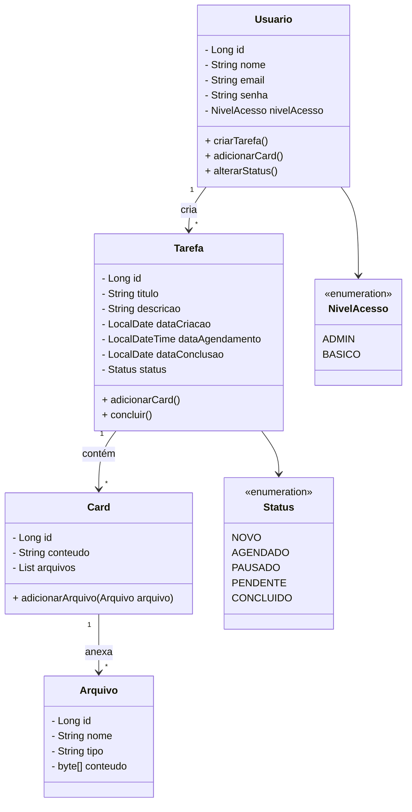

```mermaid
classDiagram
class Usuario {
        - Long id
        - String nome
        - String email
        - String senha
        - NivelAcesso nivelAcesso
        + criarTarefa()
        + adicionarCard()
        + alterarStatus()
    }

    class Tarefa {
        - Long id
        - String titulo
        - String descricao
        - LocalDate dataCriacao
        - LocalDateTime dataAgendamento
        - LocalDate dataConclusao
        - Status status
        + adicionarCard()
        + concluir()
    }

    class Card {
        - Long id
        - String conteudo
        - List<Arquivo> arquivos
        + adicionarArquivo(Arquivo arquivo)
    }

    class Arquivo {
        - Long id
        - String nome
        - String tipo
        - byte[] conteudo
    }

    class NivelAcesso {
        <<enumeration>>
        ADMIN
        BASICO
    }

    class Status {
        <<enumeration>>
        NOVO
        AGENDADO
        PAUSADO
        PENDENTE
        CONCLUIDO
    }

    Usuario "1" --> "*" Tarefa : cria
    Tarefa "1" --> "*" Card : contém
    Card "1" --> "*" Arquivo : anexa

    Usuario --> NivelAcesso
    Tarefa --> Status
```
