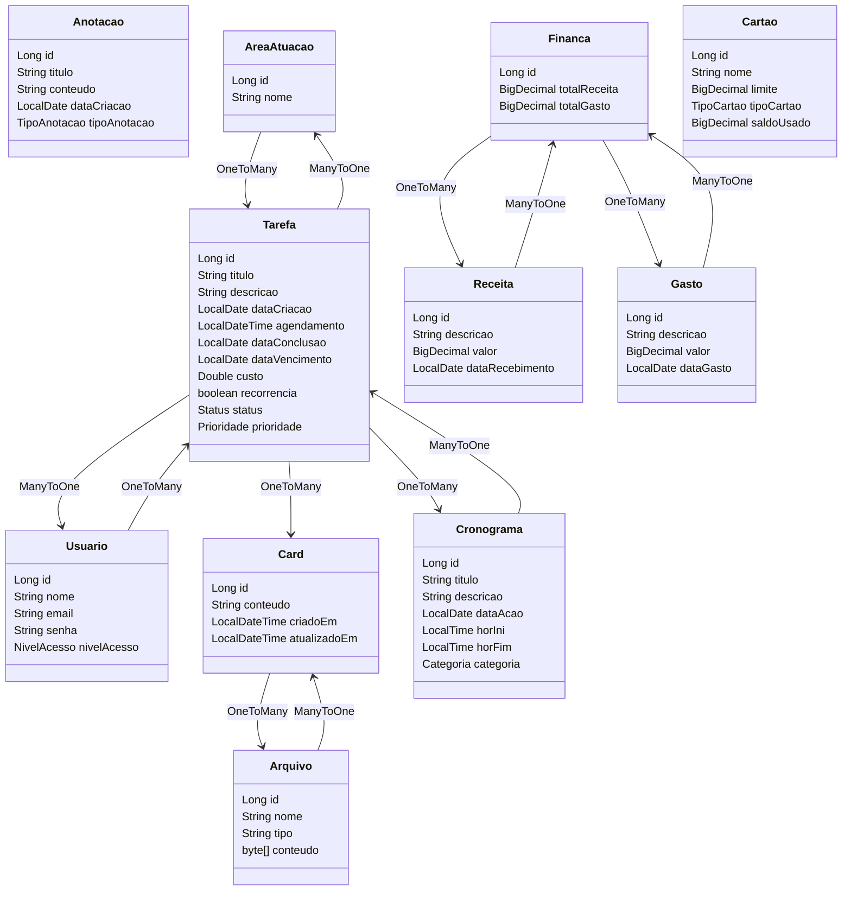

```mermaid
classDiagram
   class Anotacao {
        Long id
        String titulo
        String conteudo
        LocalDate dataCriacao
        TipoAnotacao tipoAnotacao
    }

  class AreaAtuacao {
        Long id
        String nome
    }

   class Tarefa {
        Long id
        String titulo
        String descricao
        LocalDate dataCriacao
        LocalDateTime agendamento
        LocalDate dataConclusao
        LocalDate dataVencimento
        Double custo
        boolean recorrencia
        Status status
        Prioridade prioridade
    }

  class Usuario {
        Long id
        String nome
        String email
        String senha
        NivelAcesso nivelAcesso
    }

  class Financa {
        Long id
        BigDecimal totalReceita
        BigDecimal totalGasto
    }

  class Receita {
        Long id
        String descricao
        BigDecimal valor
        LocalDate dataRecebimento
    }

  class  Gasto {
        Long id
        String descricao
        BigDecimal valor
        LocalDate dataGasto
    }

  class Card {
        Long id
        String conteudo
        LocalDateTime criadoEm
        LocalDateTime atualizadoEm
    }

  class Arquivo {
        Long id
        String nome
        String tipo
        byte[] conteudo
    }

  class Cartao {
        Long id
        String nome
        BigDecimal limite
        TipoCartao tipoCartao
        BigDecimal saldoUsado
    }

  class Cronograma {
        Long id
        String titulo
        String descricao
        LocalDate dataAcao
        LocalTime horIni
        LocalTime horFim
        Categoria categoria
    }

    AreaAtuacao --> Tarefa : OneToMany
    Tarefa --> Card : OneToMany
    Tarefa --> Cronograma : OneToMany
    Usuario --> Tarefa : OneToMany
    Financa --> Receita : OneToMany
    Financa --> Gasto : OneToMany
    Card --> Arquivo : OneToMany
    Tarefa --> AreaAtuacao : ManyToOne
    Tarefa --> Usuario : ManyToOne
    Receita --> Financa : ManyToOne
    Gasto --> Financa : ManyToOne
    Arquivo --> Card : ManyToOne
    Cronograma --> Tarefa : ManyToOne
```
